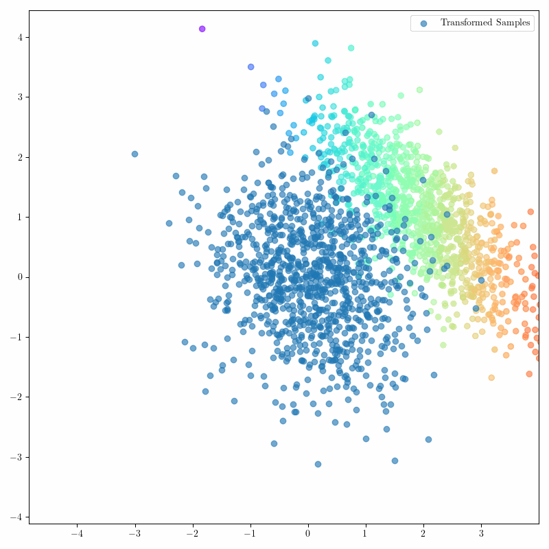
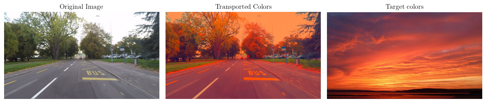

# Learning-Gradient-of-Convex-Functions-Using-Neural-Network
This repository contains the implementation of the paper "Learning Gradients of Convex Functions with Monotone Gradient Networks". The paper introduces two new neural architectures that helps in learning gradient of convex functions. This has also an utility in optimal transport domain mainly the Brenier Map Theorem.

## Optimal Coupling

The goal of this section is to learn an optimal transport map $T$ that pushes forward samples from the source distribution $\alpha$ to a standard normal distribution $\beta$ 

    
    

## Color Domain Adaptation

One interesting application of the proposed networks is to learn to map daytime road scenes to identical scenes but at suntime.

The following animation shows how the process of transporting colors is done throughout the training

